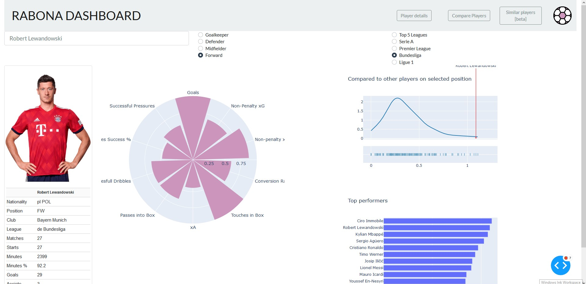
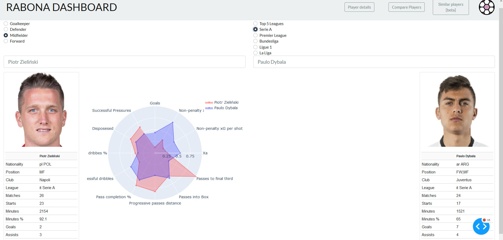
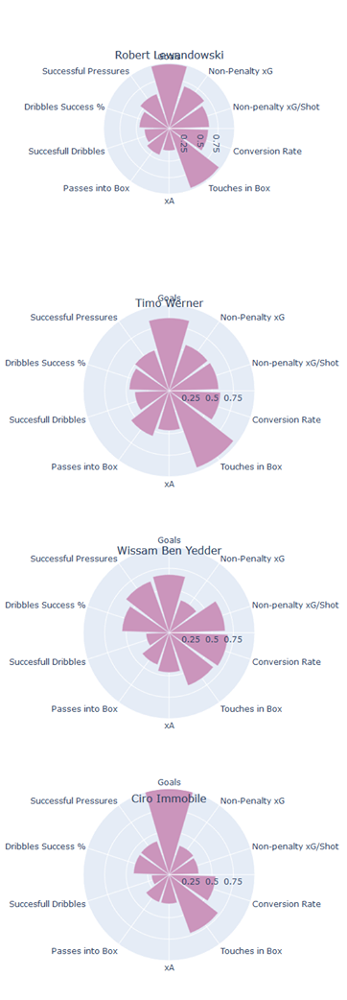

# Rabona Dashboard
Rabona is a stats visualization tool that allows you to see player statistics, compare two players and find players similar to selected. 
TOP 5 european football leagues are covered with data by [fbref.com](https://www.fbref.com) and [statsbomb.com](https://www.statsbomb.com).

It is my final project for [Kodolamacz Data Science Bootcamp](https://www.kodolamacz.pl/bootcamp-datascience/).

## Built with
- Python
- Pandas
- Plotly Dash
- Bootstrap Dash Components

## Features
1. Detailed player's statistics
Display Polar Bar Chart with player statistics. Attributes are different depending on player's position. You can also see stats compared with selected league. 
Click on attribute to see more details, like distribution and best performers 

2. Compare two players
Compare attributes of two players

3. Find similar players
Based on player's attributes we are able to find similarites with other TOP5 leagues players. This can be useful when team is searching for new player to replace team member.
